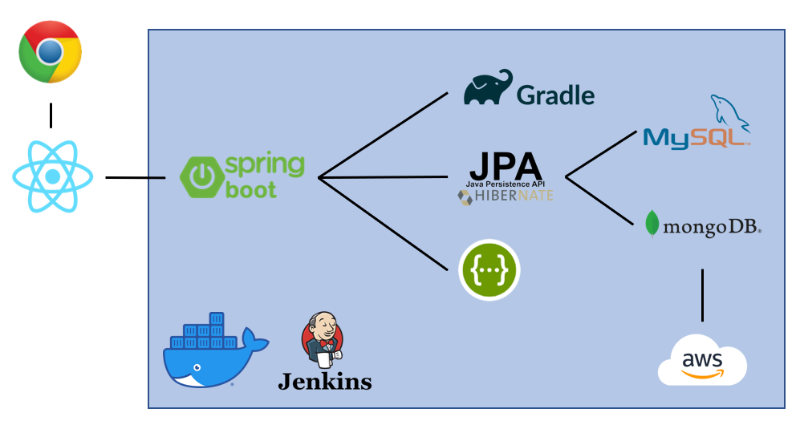

# 아키텍처(Architecture) 설계

> ### 🌞 이 문서는 ..
>
> ### 앞으로 구현해야 할 프로젝트에서
>
> ### 사용할 `아키텍처`를 정리한 문서

# Architecture

이미지를 클릭하면 크게 보입니다.

# Environment

## Front-end

- HTML5
- CSS3
- JavaScript(ES6)
- React
- TypeScript
- Next.js
- Semantic UI React

## Back-end

- Spring Boot
- JPA
- Gradle
- Swagger
- QueryDSL

## CI/CD

- Jenkins

## SERVER

- Docker
- AWS
- AWS S3

## DB

- MySQL
- mongoDB
