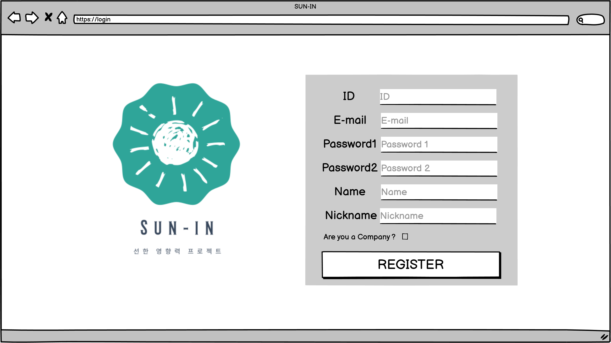
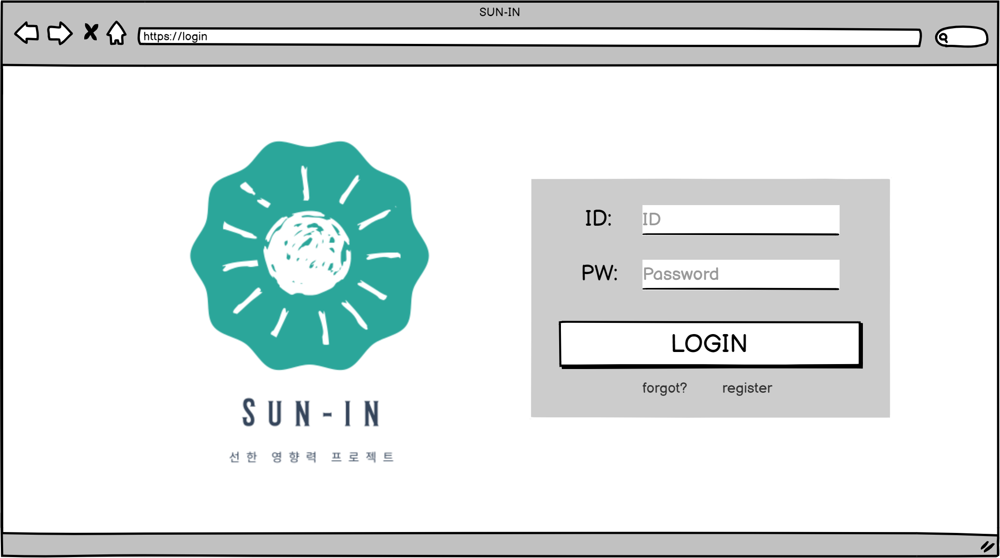
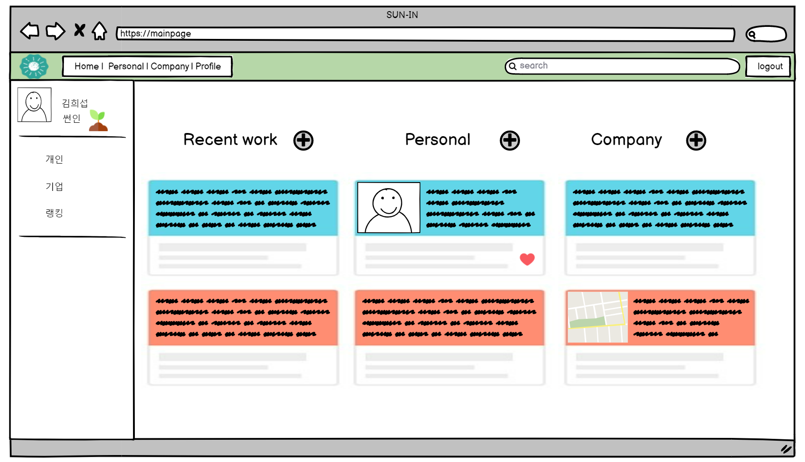
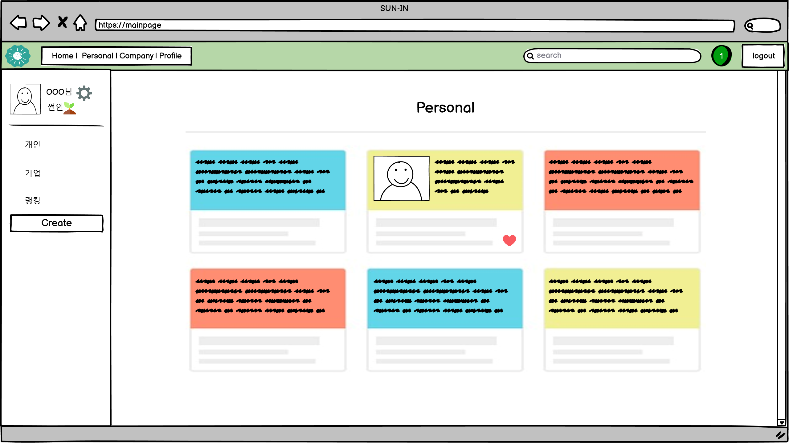

# 와이어프레임 작성

> ### 🌞 이 문서는 ..
>
> ### 앞으로 구현해야 할 웹 페이지들의
>
> ### 청사진인 `와이어프레임`을 작성한 문서

## 서비스를 개발하기 전 기획 고민

1. 회원가입
2. 로그인 -> 메인페이지
3. 회원 정보 수정
4. 프로필
5. 팔로우, 좋아요 기능
   - 팔로잉 / recent / 팔로우한 소식
6. 개인
   - 추천 알고리즘 (최신순, 좋아요순)
7. 회사
   - 카테고리(전체, 이벤트, 제품홍보 등으로 나눠서 보여주는데) 이 안에서 최신순, 좋아요순, 무작위로 정렬가능
8. 서치바 - 계정검색, 태그검색
9. 참여 게이지 & (추가기능)

## 회원가입

이메일과 패스워드로 회원가입을 진행합니다.

## 로그인

이메일과 패스워드로 로그인을 진행합니다.

## 메인페이지

처음으로 보게되는 메인 페이지

Recent work: 팔로잉한 유저 글

Personal: 개인 글

Company: 기업 글

## 개인 피드

개인이 쓴 글을 보여주는 페이지입니다. CRUD 기능을 제공합니다.

## 기업 피드

기업이 쓴 글을 보여주는 페이지입니다.

## 프로필(개인)

개인 프로필을 나타내는 페이지입니다. 방문일수, 뱃지, 팔로잉, 팔로워가 나타납니다.

## 프로필(기업)

기업 프로필을 나타내는 페이지. 팔로잉, 팔로워 등을 나타냅니다.

## 글작성 페이지

게시물을 작성하는 페이지입니다.

## 정보수정 페이지

개인정보를 수정할 수 있습니다.
