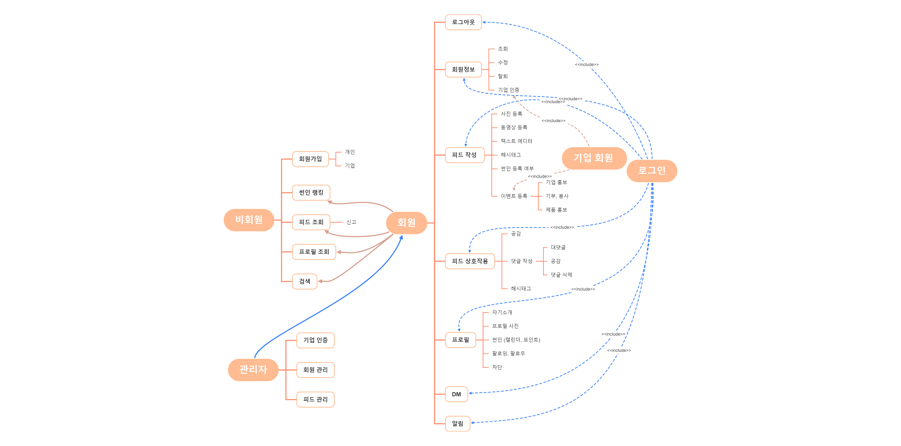

# 유스케이스 작성

> ### 🌞 이 문서는 ..
>
> ### 회원, 비회원 그리고 관리자의 `유스케이스(Use Case)` 간의
>
> ### 관계를 정리한 `유스케이스 다이어그램`을 작성한 문서

# 유스케이스 다이어그램

이미지를 클릭하면 크게 보입니다.

# 유스케이스 명세

## 비회원

- 회원가입
  - 개인
  - 기업
- 썬인 랭킹 (썬인 포인트 여부)
- 피드 조회
  - 신고
- 프로필 조회
- 검색

## 회원

- 로그아웃
- 회원정보
  - 조회
  - 수정
  - 탈퇴
  - 기업 인증
- 피드 작성
  - 사진 등록
  - 동영상 등록
  - 텍스트 에디터
  - 해시태그
  - 썬인 등록 여부
  - 이벤트 등록
    - 기업 홍보
    - 기부, 봉사
    - 제품 홍보
- 피드 상호작용
  - 공감
  - 댓글 작성
    - 대댓글
    - 공감
    - 댓글 삭제
  - 해시태그
- 프로필
  - 자기소개
  - 프로필 사진
  - 썬인 (캘린더, 포인트)
  - 팔로잉, 팔로우
  - 차단
- DM
- 알림

## 관리자

- 기업 인증
- 회원 관리
- 피드 관리
